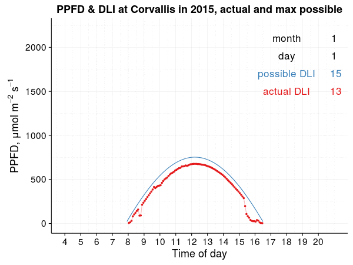
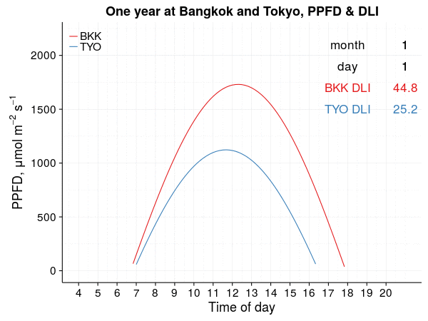

I've shared some charts of photosynthetically active radiation (PAR) as it changes through the day and through the year at different locations. For example, this is the PAR at Corvallis for each day of 2015.

For each day, as a function of latitude, and for each time within the day, as a function of both latitude and longitude, there is a maximum possible quantity of PAR. Then, in areas with no tree or structural shade, the PAR will be close to the maximum possible quantity, unless there are clouds.

But how much do the clouds reduce PAR? If you carry a PPFD meter around with you all the time, you can check it yourself. If you don't carry a PPFD meter, I suggest this rule of thumb to get some idea of just how much the clouds are reducing PAR.



I explained this at the 2016 Asian Turfgrass Field Day, when it was conveniently partly cloudy, with clouds of varying thickness, and I also conveniently had a meter for measuring the PPFD.

If you don't have a meter, but pay attention to your shadow, clouds, and the sun location, you can get a pretty accurate estimate of PPFD. Here's the rule of thumb, for four possible levels of cloud shade:

1. If there are no clouds, or there are no clouds between you and the sun, then you can expect the cloud shade to be negligible, and the PAR should be close to the maximum possible. [This app](https://asianturfgrass.shinyapps.io/ppfd_by_time/) calculates the maximum possible for any location.

2. If you can see your shadow, but there are clouds between you and the sun, then expect the PAR to be reduced by about 25%.

3. If the clouds block so much light that you cannot see your shadow, but you can still tell which part of the sky the sun is in, expect the PAR to be reduced by about 50%.

4. If you cannot see your shadow, and at the same time the clouds are so thick that you cannot tell where the sun is in the sky, then expect the PAR to be reduced by about 75%.

When there are no clouds, then one will see the maximum possible PAR, as shown in this chart for Bangkok and Tokyo. They are different because Bangkok is about 13 degrees north of the equator, and Tokyo is 35 degrees north.

One can also look at measurements of solar radiation and express them in units of PAR. Now the cloud effects are taken into account. For example, [this is Ithaca, NY,][6] and you can see the effect of clouds on PAR.

PAR data for Corvallis and Ithaca are converted from the global solar radiation measurement of the [U.S. Climate Reference Network sub-hourly data](https://www.ncei.noaa.gov/access/crn/qcdatasets.html). I usually use a transmittance value of 0.75 on a clear day to estimate the portion of extraterrestrial solar radiation (Ra) that reaches the surface as global solar radiation (Rs). That's the basis for the _max possible_ (blue lines) I've shown on these charts. But these ones use different transmittance values. I used 0.68 for Corvallis, and 0.8 for Ithaca, because those are what made a good match for the USCRN data for those locations. I'm not sure why the measurements are different on clear days &#8212; Ithaca has a higher Rs than does Corvallis but only a small difference in latitude. That's something I'll study some more.
