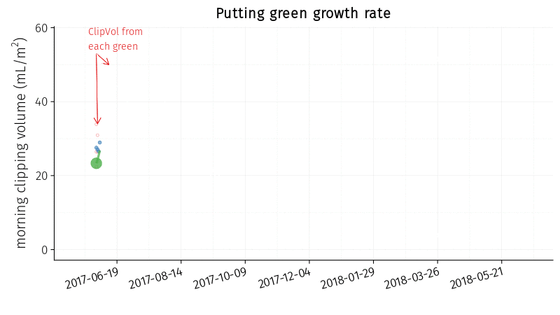

A full year of putting green clipping volume measurements looks like this.

Well, it's like that with a number of caveats. This is what it looked like:

* at this location 21° N latitude
* with seashore paspalum turf
* managed the way it was
* with the weather of the past year
* growing in the soil conditions of this site
* irrigated with this water
* etc.

I'd like to emphasize that the growth is in some ways out of the control of the turf manager, but the *managed the way it was* category is a big one, and in that way the growth is adjusted, or even controlled, by the turf manager.

This is especially useful if one finds the optimum growth for one's site, and can then set a target for upcoming events.

Three recent conversations, or things I've seen, are related to this.

First, a superintendent wrote to me, "I %#!&^% love #ClipVol. What a useful tool it's been for us this season ... We'll mow tomorrow but I'll skip green 14 because of its slow growth rate. I also want to increase the growth rate so that's why I'm applying N tomorrow." 

That's good use of these data. I predict turf on 14 green will be better for not having been mowed, and of course applying N is going to move the growth rate closer to what this superintendent wants. With a number for the growth rate, it's easy to make these adjustments. 

Second, Jon Merchant is measuring the clipping volume and finds the grass keeps on growing even more than desired, even with ["no N since May 4th"](https://twitter.com/Walsall_Greens/status/1004339720032309248):



Here's a case where N applications seem to be delayed, skipped, or reduced in order to bring the growth rate to a desired level.

Third, Allan Dewald showed how temperature---and the associated increase in turfgrass growth potential---are ["interacting"](https://twitter.com/allan_dewald/status/1002037683189792774) with clipping yields:



One can look at forecast temperatures and plan out fertilizer applications to hit the desired growth rates, and then make adjustments on the fly.

One can also adjust other things that will affect the clipping volume, such as growth regulators, soil water content, or rolling.



One more thing---Allan made note of the double Y axis chart. That chart shows what he wanted it to show, although I'd like to think he was pointing the dual axes out as a disclaimer for the viewer. For more about the use of 2 y-axes, [see this](https://blog.datawrapper.de/dualaxis/).
