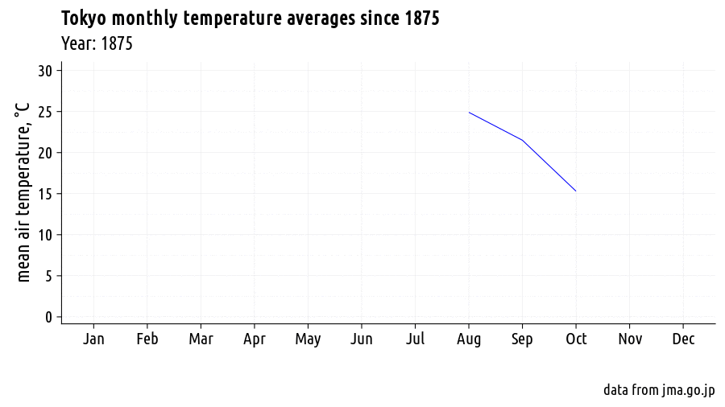
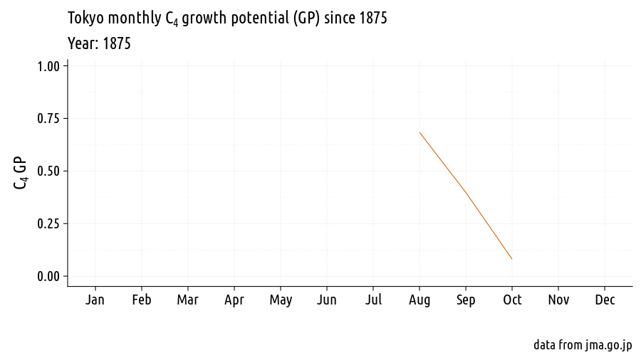

---
bigmedia:
- jp_thermometer.jpg: surface & soil temperatures from a creeping bentgrass putting
    green, Japan
date: "2019-03-10T00:00:00Z"
share-media: https://www.asianturfgrass.comjp_thermometer.jpg
tags:
- climate
- temperature
- japan
title: Tokyo temperatures and growth potential, animated
---

I made a note a couple months ago to make animated charts showing the cool-season (C<sub>3</sub>) and warm-season (C<sub>4</sub>) turfgrass growth potential over a 100+ year period for Tokyo. I was interested to see what those charts would look like. Here's my note:

```
Animate 100 years of GP curves with shadow
do an animation in Japan of GP through the years and see
if leaving shadows show something like a shift that
implies getting better for C3 or better for C4
```

First I got the average monthly temperatures from Tokyo since 1875.



Then, from those temperature data, I calculated the [temperature-based growth potential (GP)](https://www.asianturfgrass.com/2017-09-01-gp-explained-photos/) for cool-season grass and plotted that with a shadow.


And then I did the same for the warm-season turfgrass GP.



The code I used to make these charts is in [this gist](https://gist.github.com/micahwoods/a01d0394d057c455e5607caeaecd6a7a).

If you are really interested in these temperature changes, check out the chart and analysis by [Ryo Nakagawara, here](https://twitter.com/R_by_Ryo/status/1101808344384233473), which shows temperatures increased by about 3 °C in winter months and about 2 °C in summer over the past ~140 years.

